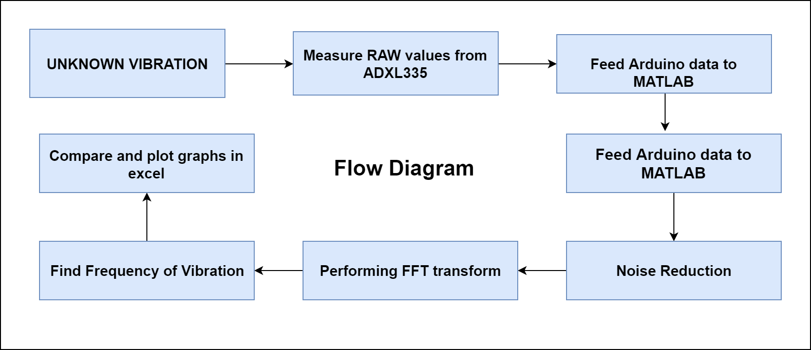
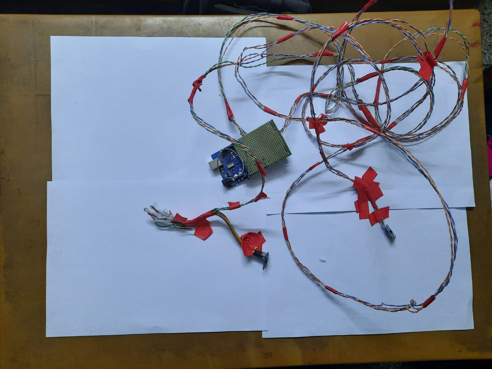

# Mechanical_Vibration_Analysis_with_MATLAB_and_Arduino
This is a real time project where I used ADXL335, a 3-axis-accelerometer to measure unknown vibration and then analyze them in matlab and plot them in excel

### The Main Objectives:
The main task is for this project is to find the car's (test object) vibration and analysis all the outputs. With the similar set-up and codes anykind of mechanical vibration of an object can be found.

### Flow-Diagram of the Project

### Theoretical Background
* For understand about the mechanical vibration analysis, this paper is very much useful:
[Measuring-mechanical-vibrations.pdf](Measuring-mechanical-vibrations.pdf)
* To know how to work with ADXL335 sensor, this [LastMinuteEngineers](https://lastminuteengineers.com/adxl335-accelerometer-arduino-tutorial/) tutorial is very much helpful. 
* Check the [ADXL335 datasheet](ADXL335.pdf)

 
### Components
* Arduino
* ADXL335 3-axis accelerometer (minimum 2 for comparing outputs)
* long wires (I used cat6 cable)
* veroboard, male headers, jumper cable, soldering iron etc.
* 5V power-supply, can be a power-bank, or battery. (I used laptop's usb output as powering the setup) 
* Vibration speaker (I didn't have any. but it is very useful for check the results for a given frequency)
### The main setup 
The whole device looked like this.

